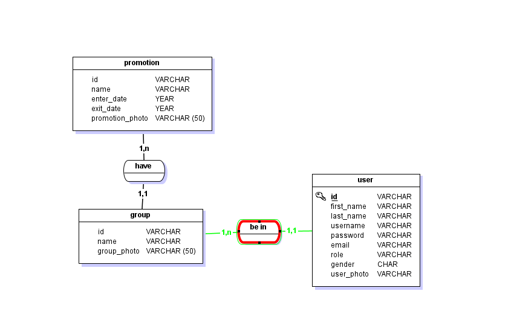

# HEI - Tribu :man_technologist:

Welcome to this inter-student project at HEI, this is the back-end of the project.

### :hammer_and_wrench: Languages and Tools :

1. Java is the principal lanquage used in this back-end part. Java 17 or higher.
2. Maven is the main dependency manager 
3. Postgresql is the database.
4. To load your dependancies in this project:
<ul>
    <li>if you use intelliJ let it automatically download the dependencies after cloning this project.</li>
    <li>if you are using another editor use the maven commands (mvn) to take the dependencies.</li>
</ul>

### The schemas of database:

    

# :fire: enjoy !!
